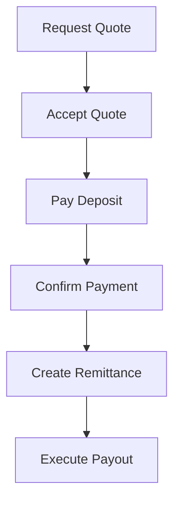
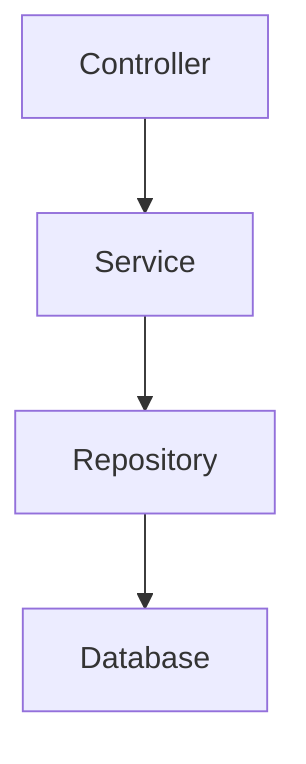

<!-- START doctoc generated TOC please keep comment here to allow auto update -->
<!-- DON'T EDIT THIS SECTION, INSTEAD RE-RUN doctoc TO UPDATE -->
**Table of Contents**  *generated with [DocToc](https://github.com/thlorenz/doctoc)*

- [Quote-Based Remittance System (Backend)](#quote-based-remittance-system-backend)
  - [Overview](#overview)
  - [Core Concept](#core-concept)
  - [Tech Stack](#tech-stack)
  - [Project Structure](#project-structure)
  - [How to Run the Application](#how-to-run-the-application)
    - [Step 1: Clone the Repo](#step-1-clone-the-repo)
    - [Step 2: Start PostgreSQL](#step-2-start-postgresql)
    - [Step 3: Run Sprint Boot App](#step-3-run-sprint-boot-app)
    - [Step 4: Access Application](#step-4-access-application)
  - [Features (Planned / In Progress)](#features-planned--in-progress)
    - [Quote Service](#quote-service)
    - [Deposit Service](#deposit-service)
    - [Remittance Service](#remittance-service)
  - [System Features](#system-features)
  - [Key System Rules](#key-system-rules)
  - [Development Notes](#development-notes)
  - [Architecture Philosophy](#architecture-philosophy)
  - [Future Improvements](#future-improvements)
  - [Author](#author)
  - [Summary](#summary)

<!-- END doctoc generated TOC please keep comment here to allow auto update -->

# Quote-Based Remittance System (Backend)

## Overview
This project is a **Quote-Based Money Remittance System** built with Java 21 + Spring Boot + PostgreSQL + Docker.

It simulates real-world fintech systems like Wise or Flutterwave by allowing users to:

- Request exchange quotes
- Lock exchange rates for a limited time
- Make payments (deposits)
- Process remittances securely
- Track transaction status

---

## Core Concept



This ensures:
- Rate consistency (locked exchange rate)
- Transaction safety
- Prevent duplicate charges (idempotency)
- Reliable money movement workflow

---

## Tech Stack
- Java 21
- Sprint Boot 4
- Sprint Data JPA
- PostgreSQL
- Docker
- Maven

---

## Project Structure
```
src/main/java/com/remittance
│
├── config/        → Application configuration (security, CORS, etc.)
├── controller/    → REST APIs (HTTP endpoints)
├── service/       → Business logic layer
├── repository/    → Database access layer (JPA)
├── domain/        → Database entities (Quote, Deposit, Remittance)
├── dto/           → Request & response objects
├── exception/     → Custom exceptions & error handling
└── util/          → Helper classes (ID generators, etc.)
```

---

## How to Run the Application

### Step 1: Clone the Repo
```
git clone https://github.com/kadelcode/quote-remittance-backend.git
```
then:
```
cd quote-remittance-backend
```

---

### Step 2: Start PostgreSQL
```
docker-compose up -d
```

---

### Step 3: Run Sprint Boot App
From IntelliJ:
- Click **Run**

OR
```
mvn sprint-boot:run
```

---

### Step 4: Access Application
```
http://localhost:8080
```

---

## Features (Planned / In Progress)

---

### Quote Service
- Request exchange rate quote
- Fee calculation
- Quote expiration

### Deposit Service
- Payment initiation
- Payment confirmation
- Failure handling

### Remittance Service
- Funds transfer simulation
- Status tracking
- Failure recovery

---

## System Features

- Idempotency handling
- Transaction safety
- Audit logging
- Notification system

---

## Key System Rules
- Quotes expire after a fixed time (e.g. 5 minutes)
- Exchange rate is locked once quote is created
- Used or expired quotes cannot be reused
- Only confirmed deposits trigger remittance

---

## Development Notes
- Open API endpoints will be added using REST controllers
- PostgreSQL is used for persistence
- Hibernate auto-generates tables (`ddl-auto=update`)
- Docker is used for local DB setup

---

## Architecture Philosophy
This project follows **layered architecture**:

This ensures:
- Separation of concerns
- Testability
- Scalability
- Clean code structure

---

## Future Improvements
- JWT Authentication
- Redis caching for quotes
- Kafka for async processing
- Microservice split (optional)
- CI/CD pipeline (GitHub Actions)

---

## Author
Built as a learning + system design project to simulate real-world fintech **remittance systems**.

---

## Summary
This project demonstrates:
- Backend system design
- Payment workflow simulation
- Database Design
- Docker-based infrastructure
- Clean layered architecture
